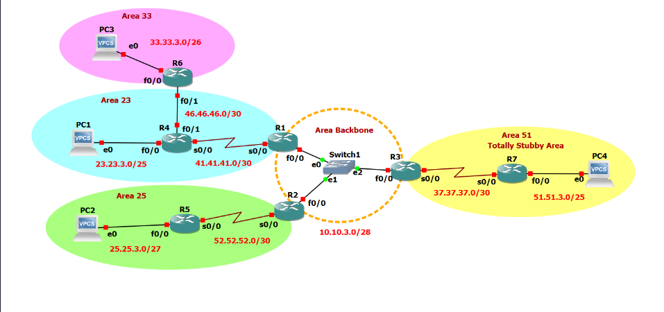

#### Resumen

En esta práctica se configuró un entorno de red utilizando el protocolo de enrutamiento **OSPF (Open Shortest Path First)** en un escenario multitarea. El objetivo principal fue implementar y validar la segmentación de la red en múltiples áreas para optimizar el enrutamiento y aplicar los conceptos vistos en las sesiones anteriores. Se configuraron varias áreas OSPF, incluyendo el Área 0 (Backbone) y áreas secundarias como el Área 33, en la cual se implementó un _virtual-link_ debido a que no tiene una conexión física directa con el Área 0; el Área 23, el Área 25 y, finalmente, el Área 51, que se configuró como una **Totally Stubby Area**.

Durante la elaboración, se analizaron los beneficios de utilizar una estructura de red multiarea, como la reducción del tamaño de las tablas de enrutamiento gracias al trabajo del Área 0 y la mejora en la convergencia de la red. Además, se implementaron y verificaron diferentes tipos de routers OSPF, como los routers ABR y ASBR, logrando demostrar cómo la información de enrutamiento se maneja y se redistribuye en una topología segmentada.

Los resultados mostraron una conectividad correcta entre cada una de las áreas mencionadas, validando el esquema propuesto por el profesor y resaltando la importancia de una correcta planificación y segmentación en una red de áreas OSPF.
 
*****
### Topología:

**Elementos a configurar:**

- Area 0 / Backbone
	- R1.
	- R2
	- R3
- Area 33:
	- R6
	- Virtual-link.
	- VPCS 3
- Area 25:
	- R5
	- VPCS 2
- Area 23:
	- R4
	- VPCS1
- Area 51:
	- R7
	- Totally Stubby Area.
 
******
#### Tablas de direccionamiento

Establecemos las direcciones IP que tendrán los dispositivos de cada área para facilitar el proceso durante la configuración.

Primero, se definen las direcciones que tendrán las **VPCS**, incluyendo su **default gateway** y la interfaz por donde se conectarán.

- VPCS

| Dispositivos | Areas |  IP Address  | Interfaz | Default Gateway |
| :----------: | :---: | :----------: | :------: | :-------------: |
|    VPCs1     |  23   | 23.23.3.2/25 |    e0    |  23.23.3.1/25   |
|    VPCs2     |  25   | 25.25.3.2/27 |    e0    |  25.25.3.1/27   |
|    VPCs3     |  33   | 33.33.3.2/26 |    e0    |  33.33.3.1/26   |
|    VPCs4     |  51   | 51.51.3.2/25 |    e0    |  51.51.3.1/25   |

A partir de aquí se establecen las direcciones IP que tendrán cada uno de los dispositivos dentro de su área correspondiente, junto con su máscara de subred y la interfaz a la que corresponde:

- Área 0

| Dispositivos | Area |  IP Address  | Interfaz |
| :----------: | :--: | :----------: | :------: |
|      R1      |  0   | 10.10.3.1/28 |   F0/0   |
|      R2      |  0   | 10.10.3.2/28 |   F0/0   |
|      R3      |  0   | 10.10.3.3/28 |   F0/0   |

- Área 23

| Dispositivos | Area |  IP Address   | Interfaz |
| :----------: | :--: | :-----------: | :------: |
|      R1      |  23  | 41.41.41.1/30 |   S0/0   |
|      R4      |  23  | 41.41.41.2/30 |   S0/0   |
|      R4      |  23  | 23.23.3.1/25  |   F0/0   |
|      R4      |  23  | 46.46.46.1/30 |   F0/1   |
|      R6      |  23  | 46.46.46.2/30 |   F0/1   |

- Área 25

| Dispositivos | Area | IP Address    | Interfaz |
| ------------ | ---- | ------------- | -------- |
| R2           | 25   | 52.52.52.1/30 | S0/0     |
| R5           | 25   | 52.52.52.2/30 | S0/0     |
| R5           | 25   | 25.25.3.1/27  | F0/0     |

- Área 33

| Dispositivos | Area | IP Address   | Interfaz |
| ------------ | ---- | ------------ | -------- |
| R6           | 33   | 33.33.3.1/26 | F0/0     |

- Área 51 Totally Stubby Area

| Dispositivos | Area | IP Address    | Interfaz |
| ------------ | ---- | ------------- | -------- |
| R3           | 51   | 37.37.37.1/30 | S0/0     |
| R7           | 51   | 51.51.3.1/25  | F0/0     |
 

****
### Comandos utilizados durante el proceso

Antes de comenzar decidimos adjuntar algunos de los comandos que fueron de gran ayuda para entender y revisar el proceso de OSPF

>[!tip] **Tip**
>**Comandos para observar el proceso OSPF**
>* show ip route
>* show ip ospf 
>* show ip ospf route
>* show ip ospf neighbors
>* show ip ospf database

>[!tip] **Tip**
>* **Ver todos los LSA's:**
>*show ip ospf database*
>
>* **Ver un tipo especifico de LSA:**
>*show ip ospf database [lsa-type]*
>- `router` para LSA type 1
>- `network` para LSA type 2
>- `summary` para LSA type 3 y 4
>- `asbr-summary` para type 4
>- `external` para LSA type 5

##### Area 0 / Backbone

Para realizar las configuraciones de la topología, comenzamos primero con el Área 0. En primer lugar, asignamos a cada interfaz su dirección IP y, como punto importante, configuramos la prioridad en R1 y R2 para que se designen como DR y BDR, respectivamente. 

>[!tip] **Importante**
>Un **DR** y **BDR** es importante en OSPF para optimizar la comunicación y el intercambio de información de enrutamiento en redes multitareas con múltiples routers conectados a un mismo segmento de red.
>

Después de configurar cada una de las interfaces conectadas, habilitamos el protocolo de enrutamiento OSPF, asignando el número de proceso, el **Router ID** para identificar a cada uno de los routers dentro del proceso, y finalmente las redes que cada uno de ellos conoce, junto con su segmento de red, wildcard y el área a la que corresponden.

- **Configuraciones para R1:**

~~~python
r1# configure terminal
r1(config)# interface F0/0
r1(config)# ip ospf priority 255
r1(config-if)# ip address 10.10.3.1 255.255.255.240
r1(config-if)# no shutdown
r1(config-if)# exit

r1(config)# int S0/0
r1(config)# ip ospf priority 255
r1(config-if)# ip address 41.41.41.1 255.255.255.252
r1(config-if)# no shutdown
r1(config-if)# exit

r1(config)# router ospf 3
r1(config-router)# router-id 30.30.30.30
r1(config-router)# network 10.10.3.0 0.0.0.15 area 0
r1(config-router)# network 41.41.41.0 0.0.0.3 area 23
r1(config-router)# area 23 virtual-link 3.3.3.3
~~~

>[!warning] **Importante**
>R1 se configura con un _virtual-link_ hacia R6 utilizando el RID 3.3.3.3, ya que no tiene una conexión física directa con R1, que es nuestro ABR hacia el Backbone (Área 0).

- **Configuraciones para R2**

~~~python
r2# configure terminal
r2(config)# interface F0/0
r2(config)# ip ospf priority 200
r2(config-if)# ip address 10.10.3.2 255.255.255.240
r2(config-if)# no shutdown
r2(config-if)# exit

r2(config)# int S0/0
r2(config)# ip ospf priority 200
r2(config-if)# ip address 52.52.52.1 255.255.255.252
r2(config-if)# no shutdown
r2(config-if)# exit

r2(config)# router ospf 3
r2(config-router)# router-id 20.20.20.20
r2(config-router)# network 10.10.3.0 0.0.0.15 area 0
r2(config-router)# network 52.52.52.0 0.0.0.3 area 25
~~~

- **Configuraciones para R3**

~~~python
r3# configure terminal
r3(config)# interface F0/0
r3(config-if)# ip address 10.10.3.3 255.255.255.240
r3(config-if)# no shutdown
r3(config-if)# exit

r3(config)# int S0/0
r3(config-if)# ip address 37.37.37.1 255.255.255.252
r3(config-if)# no shutdown
r3(config-if)# exit

r3(config)# router ospf 3
r3(config-router)# router-id 10.10.10.10
r3(config-router)# network 10.10.3.0 0.0.0.15 area 0
r3(config-router)# network 37.37.37.0 0.0.0.3 area 51
r3(config-router)# area 51 stub no-summary
r3(config-router)#default-information originate
~~~

>[!warning] **Importante**
>Se configura el Área 51 como _stub no-summary_ para establecerla como un **Área Totally Stubby**. Esto significa que el Área 51 no recibirá LSA de tipo 3, 4 y 5, y solo aceptará LSA de tipo 1 y 2.
>
Además, se asigna la ruta por defecto `0.0.0.0` utilizando el comando `default-information originate` para que el router R7 conozca por dónde enviar y recibir los paquetes fuera de su área.

******
##### Area 23

Para configurar el **Área 23**, repetimos el proceso utilizado en el Área 0, con algunas modificaciones que explicaremos más adelante. Primero, asignamos a cada interfaz su dirección IP y su máscara de subred, **sin olvidar habilitarlas**. Luego, habilitamos el protocolo de la misma forma que en el Área 0, especificando el **Router ID**, las redes que el router conoce y el área a la que pertenecen.

- **Configuraciones para R4**

~~~python
r4# configure terminal 
r4(config)# interface S0/0
r4(config-if)# ip address 41.41.41.2 255.255.255.252
r4(config-if)# no shutdown
r4(config-if)# exit

r4(config)# interface F0/0
r4(config-if)# ip address 23.23.3.1 255.255.255.128
r4(config-if)# no shutdown
r4(config-if)# exit

r4(config)# interface F0/1
r4(config-if)# ip address 46.46.46.1 255.255.255.252
r4(config-if)# no shutdown
r4(config-if)# exit

r4(config)# router ospf 3
r4(config-router)# router-id 1.1.1.1
r4(config-router)# network 41.41.41.0 0.0.0.3 area 23
r4(config-router)# network 23.23.3.0 0.0.0.127 area 23
r4(config-router)# network 46.46.46.0 0.0.0.3 area 23

~~~

Para la configuración de las VPCS se aplica el mismo procedimiento para todas. Se utiliza el comando mostrado a continuación, siguiendo la sintaxis `ip 23.23.3.0/25 23.23.3.1`, cambiando las direcciones según lo requiera cada VPCS.. 

- **Configuraciones VPCS**1

~~~python
ip 23.23.3.2/25 23.23.3.1
save
~~~
*******
##### Area 25

- **Configuraciones R5**

~~~python
r5# configure terminal
r5(config)# interface S0/0
r5(config-if)# ip address 52.52.52.2 255.255.255.252
r5(config-if)# no shutdown
r5(config-if)# exit

r5# configure terminal
r5(config)# interface F0/0
r5(config-if)# ip address 25.25.3.1 255.255.255.224
r5(config-if)# no shutdown
r5(config-if)# exit

r5(config)# router ospf 3
r5(configure-router)# router-id 2.2.2.2
r5(configure-router)# network 52.52.52.0 0.0.0.3 area 25
r5(configure-router)# network 25.25.3.0 0.0.0.31 area 25

r5(config)# interface S0/0
r5(config-if)# ip ospf 3 area 25
r5(confif-if)# interface F0/0
r5(config-if)# ip opsf 3 area 25
~~~

- **Configuración VPCs2**

~~~python
ip 25.25.3.2/27 25.25.3.1
save
~~~
*************
##### Area 33

- **Configuración para R6**

~~~python
r6# configure terminal
r6(config)# interface F0/0
r6(config-if)# ip address 33.33.3.1 255.255.255.192
r6(config-if)# no shutdown
r6(config-if)# exit

r6(config)# interface F0/1
r6(config-if)# ip address 46.46.46.2 255.255.255.252
r6(config-if)# no shutdown
r6(config-if)# exit

r6(config)# router ospf 3
r6(config-router)# router-id 3.3.3.3
r6(config-router)# network 46.46.46.0 0.0.0.3 area 23
r6(config-router)# network 33.33.3.0 0.0.0.63 area 33
r6(config-router)# area 23 virtual-link 30.30.30.30

r6(config)# interface F0/0
r6(config-if)# ip ospf 3 area 33
r6(config-if)# interface F0/1
r6(config-if)# ip ospf 3 area 23
~~~

>[!Warning] **Importante**
>#### Virtual Link
>Se configura el _virtual-link_ desde el router R6 hacia el router R1 utilizando el RID 30.30.30.30. Esto se hace mediante el siguiente comando:
>~~~bash
>area 23 virtual-link 30.30.30.30
>~~~

- **Configuración para VPC3**

~~~python
ip 33.33.3.2/26 33.33.3.1
save
~~~
*************
##### Area 51 (Totally Stubby Area)

En el Área 51, el proceso de configuración es el mismo que en las otras áreas de nuestra topología; sin embargo, esta área es una **Totally Stubby Area**, por lo que debemos especificar en el proceso OSPF que es un **Área Stub** para que pueda detectar la ruta por defecto configurada en **R3** y, de esta forma, enviar y recibir su información de manera adecuada.

- **Configuración para R7**

~~~python
r7# configure terminal 
r7(config)# interface S0/0
r7(config-if)# ip address 37.37.37.2 255.255.255.252
r7(config-if)# no shutdown
r7(config-if)# exit

r7(config)# interface f0/0
r7(config-if)# ip address 51.51.3.1 255.255.255.128
r7(config-if)# no shutdown
r7(config-if)# exit

r7(config-router)# router ospf 3
r7(config-router)# router-id 4.4.4.4
r7(config-router)# network 37.37.37.0 0.0.0.3 area 51
r7(config-router)# network 51.51.3.0 0.0.0.127 area 51
r7(config-router)#area 51 stub
r7(config-router)# exit

r7(config-if)# int s0/0
r7(config-if)# ip ospf 3 area 51
r7(config-if)# int f0/0
r7(config-if)# ip ospf 3 area 51
~~~

> [!Tip] **Recomendación**
> Dentro del _Totally Stubby Area_, es necesario configurar el router R7 como **Área Stub** para que detecte la ruta por defecto proporcionada por R3 y, de esta manera, pueda dirigir el tráfico hacia el exterior sin recibir todas las rutas y actualizaciones de la red.

 
***
