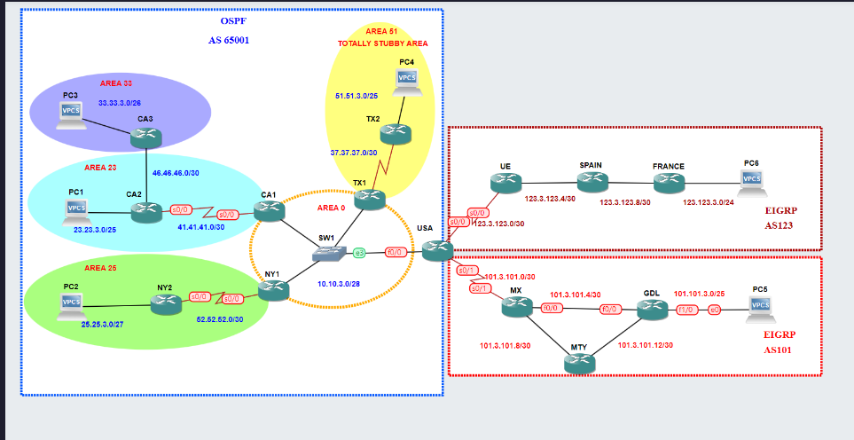

### Objetivo

El objetivo principal de esta practica es aprender y aplicar los conceptos de redistribución de rutas entre dos protocolos de enrutamiento dinámicos mayormente utilizados en ruteo interno: #OSPF `(Open Shortest Path Firts)` y #EIGRP `(Enhanced Interior Gateway Routing Protocol)` en una red simulada compuesta por 14 Routers. A través de esta practica, se busca el comprender y entender a profundidad como funciona la distribución de rutas y encontrar la mejor configuración. 

El enfoque principal es aplicar:

1. **Fundamentos de Redistribución:** 
   
   - Comprender como los protocolos #OSPF y #EIGRP gestión la información al estar trabajando con los dos.
   
   - Aprender cuando y por que es necesario redistribuir rutas entre diferentes protocolos.
   
2. **Configuración de Redistribución Bidireccional:**
   
   - Configurar la redistribución de rutas de #OSPF a #EIGRP y viceversa en los routers que actúan como frontera como limites entre las áreas de los protocolos.
   
   - Ajustar las métricas de las rutas redistribuidas para asegurar que se escojan caminos óptimos y se eviten loops.

3. **Prevención y Solución de Problemas:**
   
   - Aprender a identificar y solucionar problemas asociados con la redistribución de rutas, como loops de enrutamiento y rutas inalcanzables.
    
*****
### Topología de la red

******
### Configuraciones:

Para el router `USA` el cual conecta a los tres Sistemas Autónomos (AS) de nuestra practica, los cuales son:

- **OSPF AS 65001**
- **EIGRP AS 123**
- **EIGRP AS 101**

Tendremos que introducir en cada protocolo su respectiva redistribución con el comando `redistribute` para cada protocolo, como en #OSFP al redistribuir redes de #EIGRP y viceversa.

- **Router USA**

Configuración para el Sistema Autónomo (AS) 65001 con OSPF, donde distribuimos rutas de EIGRP 123  y 101 con dándole como parámetros que tengan un costo de 20 y que sean de metrica-1.

~~~python

USA# configure terminal 
USA(config)# int fastEthernet0/0 
USA(config-if)# ip address 10.10.3.4 255.255.255.240
USA(config-if)# no shutdown

USA(config)# router ospf 3
USA(config-router)# router-id 40.40.40.40
USA(config-router)# redistribute eigrp 123 subnets metric 20 metric-type 1
USA(config-router)# redistribute eigrp 101 subnets metric 20 metric-type 1 
USA(config-router)# network 10.10.3.0 0.0.0.15 area 0

~~~

Configuración para los dos Sistemas Autónomos (AS) de EIGRP, donde en estos redistribuirán tanto redes de OSPF AS 65001 y del los otros sistemas autónomos (AS) de EIGRP. En los parámetros de configuración para redistribuir redes de OSPF en EIGRP le pasamos como valor que tengan **Ancho de banda (Bandwidth)**, **Delay**, **Reliability (Confiabilidad)**, **Load(Carga)** y por ultimo, **MTU(Maximum Trasmission Unit)**.

~~~python

USA#configure terminal
USA(config)# interface Serial0/0
USA(config-if)# ip address 123.3.123.1 255.255.255.252
USA(config-if)# no shutdown
USA(config-if)# exit
USA(config)# interface Serial0/1
USA(config-if)# ip addrees 101.3.101.1 255.255.255.252

USA(config)# router eigrp 123
USA(config-router)# eigrp router-id 50.50.50.50
USA(config-router)# redistribute ospf 3 metric 100000 100 255 1 1500
USA(config-router)# redistribute eigrp 101
USA(config-router)# network 123.3.123.0 0.0.0.3 
USA(config-router)# no auto-summary

USA(config)# router eigrp 101
USA(config-router)# eigrp router-id 60.60.60.60
USA(config-router)# redistribute ospf 3 metric 100000 100 255 1 1500
USA(config-router)# redistribute eigrp 123
USA(config-router)# network 101.3.101.0 0.0.0.3
USA(config-router)# no auto-summary

~~~
 
