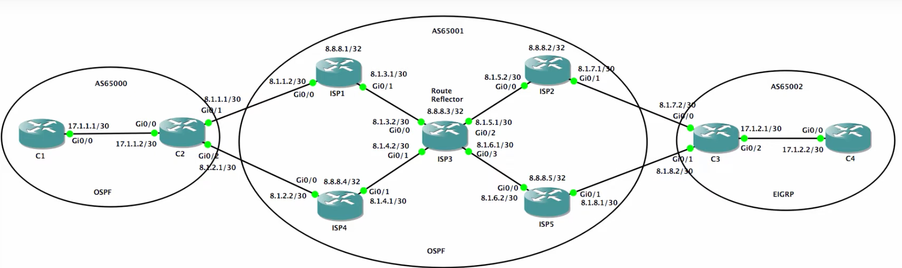

### Topologia

******

### Configuraciones AS65001

****
**ISP1**

~~~perl

hostname ISP1

interface Loopback0
ip address 8.8.8.1 255.255.255.255
no shut

interface f0/0
ip address 8.1.1.2 255.255.255.252
no shut

interface f0/1
ip address 8.1.3.1 255.255.255.252
no shut

router ospf 200
network 8.1.3.0 0.0.0.3 area 0
network 8.8.8.1 0.0.0.0 area 0

router bgp 65001
no synchronization
bgp log-neighbor-changes
network 8.1.1.0 mask 255.255.255.252
network 8.1.3.0 mask 255.255.255.252
network 8.8.8.1 mask 255.255.255.255
neighbor 8.1.1.1 remote-as 65000
neighbor 8.1.1.1 default-originate
neighbor 8.8.8.3 remote-as 65001
neighbor 8.8.8.3 update-source Loopback0
no auto-summary

~~~

**ISP2**

~~~perl
hostname ISP2

interface Loopback0
ip address 8.8.8.2 255.255.255.255

interface f0/0
ip address 8.1.5.2 255.255.255.252
no shut

interface f0/1
ip address 8.1.7.1 255.255.255.252
no shut

router ospf 200
network 8.1.5.0 0.0.0.3 area 0
network 8.8.8.2 0.0.0.0 area 0

router bgp 65001
no synchronization
bgp log-neighbor-changes
network 8.1.5.0 mask 255.255.255.252
network 8.1.7.0 mask 255.255.255.252
network 8.8.8.2 mask 255.255.255.255
neighbor 8.1.7.2 remote-as 65002
neighbor 8.1.7.2 default-originate #Distribuir default-route a C3
neighbor 8.8.8.3 remote-as 65001
neighbor 8.8.8.3 update-source Loopback0
no auto-summary
~~~

**ISP3**

~~~perl
hostname ISP3

interface Loopback0
ip address 8.8.8.3 255.255.255.255
no shut

interface f0/0
ip address 8.1.3.2 255.255.255.252
no shut

interface f0/1
ip address 8.1.4.2 255.255.255.252
no shut

interface f2/0
ip address 8.1.5.1 255.255.255.252
no shut

interface f1/0
ip address 8.1.6.1 255.255.255.252
no shut

router ospf 200
network 0.0.0.0 255.255.255.255 area 0 #Signifca que cualquier red puede participar o entrar en OSPF en el area 0

router bgp 65001

no synchronization
bgp log-neighbor-changes
redistribute connected

neighbor 8.8.8.1 remote-as 65001
neighbor 8.8.8.1 update-source Loopback0
neighbor 8.8.8.1 route-reflector-client 

neighbor 8.8.8.2 remote-as 65001
neighbor 8.8.8.2 update-source Loopback0
neighbor 8.8.8.2 route-reflector-client

neighbor 8.8.8.4 remote-as 65001
neighbor 8.8.8.4 update-source Loopback0
neighbor 8.8.8.4 route-reflector-client

neighbor 8.8.8.5 remote-as 65001
neighbor 8.8.8.5 update-source Loopback0
neighbor 8.8.8.5 route-reflector-client
no auto-summary
~~~

**ISP4**

~~~perl
hostname ISP4

interface Loopback0
ip address 8.8.8.4 255.255.255.255
no shut

interface f0/0
ip address 8.1.2.2 255.255.255.252
no shut

interface f0/1
ip address 8.1.4.1 255.255.255.252
no shut

router ospf 200
network 8.1.4.0 0.0.0.3 area 0
network 8.8.8.4 0.0.0.0 area 0

router bgp 65001
no synchronization
bgp log-neighbor-changes
network 8.1.2.0 mask 255.255.255.252
network 8.1.4.0 mask 255.255.255.252
network 8.8.8.4 mask 255.255.255.255
neighbor 8.1.2.1 remote-as 65000
neighbor 8.1.2.1 default-originate
neighbor 8.8.8.3 remote-as 65001
neighbor 8.8.8.3 update-source Loopback0
no auto-summary
~~~

**ISP5**

~~~perl
hostname ISP5

interface Loopback0
ip address 8.8.8.5 255.255.255.255
no shut

interface f0/0
ip address 8.1.6.2 255.255.255.252
no shut

interface f2/0
ip address 8.1.8.1 255.255.255.252
no shut

router ospf 200
network 8.1.6.0 0.0.0.3 area 0
network 8.8.8.5 0.0.0.0 area 0

router bgp 65001
no synchronization
bgp log-neighbor-changes
network 8.1.6.0 mask 255.255.255.252
network 8.1.8.0 mask 255.255.255.252
network 8.8.8.5 mask 255.255.255.255
neighbor 8.1.8.2 remote-as 65002
neighbor 8.1.8.2 default-originate
neighbor 8.8.8.3 remote-as 65001
neighbor 8.8.8.3 update-source Loopback0
no auto-summary
~~~

****

### Configuración AS65000

****

**C1**

~~~perl
hostname C1

interface f0/0
ip address 17.1.1.1 255.255.255.252
no shut

router ospf 100
network 17.1.1.0 0.0.0.3 area 0
~~~

**C2**

~~~perl
hostname C2

interface f0/0
ip address 17.1.1.2 255.255.255.252
no shut

interface f0/1
ip address 8.1.1.1 255.255.255.252
no shut

interface f2/0
ip address 8.1.2.1 255.255.255.252
no shut

router ospf 100
network 17.1.1.0 0.0.0.3 area 0
default-information originate

router bgp 65000
no synchronization
bgp log-neighbor-changes
network 17.1.1.0 mask 255.255.255.252
neighbor 8.1.1.2 remote-as 65001
neighbor 8.1.1.2 weight 200 #Asignamos "weight" para el tema de la prioridad
neighbor 8.1.2.2 remote-as 65001
neighbor 8.1.2.2 weight 100
no auto-summary
~~~

*****

### AS65002

*****

**C3**

~~~perl
hostname C3

interface f/0
ip address 17.1.2.1 255.255.255.252
ip summary-address eigrp 10 0.0.0.0 0.0.0.0 #Anunciamos la ruta por defecto
no shut

interface f2/0
ip address 8.1.8.2 255.255.255.252
no shut

interface f0/1
ip address 8.1.7.2 255.255.255.252
no shut

router eigrp 10
network 17.1.2.1 0.0.0.0
no auto-summary

router bgp 65002
no synchronization
bgp log-neighbor-changes
network 17.1.2.0 mask 255.255.255.252
neighbor 8.1.7.1 remote-as 65001
neighbor 8.1.7.1 weight 200
neighbor 8.1.8.1 remote-as 65001
neighbor 8.1.8.1 weight 100
no auto-summary
~~~

**C4**

~~~perl
hostname C4

interface f0/0
ip address 17.1.2.2 255.255.255.252
no shut

router eigrp 10
network 17.1.2.0 0.0.0.3
no auto-summary
~~~
