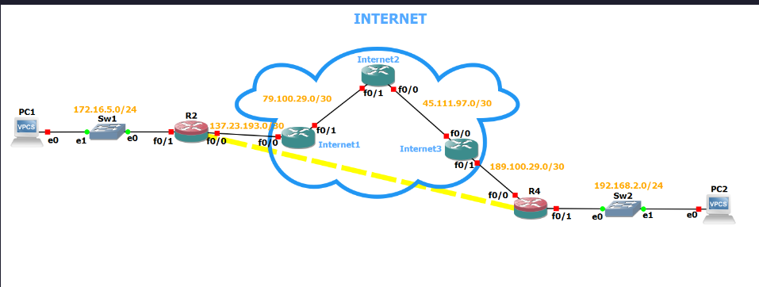

## Topologia

*******
## VPN IPsec
*****
IPsec (Internet Protocol Security) es un conjunto de protocolos diseñados para garantizar la seguridad de las comunicaciones a nivel de red mediante la autenticación y el cifrado de los paquetes IP. Es utilizado para VPN (Virtual Private Network). 

Para establecer un canal seguro, IPsec usa el Protocolo de Intercambio de Claves de Internet (IKE), que se divide en dos fases.

**Fase 1**

Se crea el canal seguro y autenticado entre los peers (Pares) para proteger las negociaciones. Existen dos modos para la fase 1:

- **Modo Principal** (Main Mode).
- **Modo Agresivo**

Durante la fase se negocian los siguientes parámetros:

- Algoritmo de cifrado
- Algoritmo de Hashing
- Grupo de Diffie-Hellman (Usualmente usar arriba del 5, mejor es el 20 y 21)
- Método de Autenticación (PSK o Certificados)
- Tiempo de Vida de la SA (Security Association)

**Fase 2**

Se negocian las IPsec SAs que protegerán el trafico. Esta fase utiliza el **Modo Rápido** (Quick Mode) y se centra en:

- Selección de Protocolo de Seguridad
- Algoritmo de Cifrado Hashing
- Parámetros de PFS (Perfect Forward Secrecy)
- Tiempo de Vida de las IPsec SA

### Modo de Transporte:

IPsec opera de dos maneras principales, estas determinan como se encapsulan y protegen los datos:

- Modo Transporte (Transport Mode): Solo la carga útil del paquete IP es cifrada y/o autenticada, dejando intacta la cabecera IP original. Solo se usa o se suele utilizar para conexiones host to host.
- Mode Tunel (Tunnel Mode) Todo el paquete IP original incluyendo la header es cifrado y encapsulado dentro de un nuevo paquete IP con un nuevo header. Se suele utilizar entre VPNs site to site.

[privacyaffairs.com](https://www.privacyaffairs.com/es/ipsec-vpn/)
[surfshark.com](https://surfshark.com/es/blog/ipsec-vpn)
[Cisco.com](https://www.cisco.com/c/en/us/td/docs/net_mgmt/vpn_solutions_center/2-0/ip_security/provisioning/guide/IPsecPG1.html)
[Comandos para IPsec](https://www.cisco.com/c/en/us/td/docs/net_mgmt/vpn_solutions_center/2-0/ip_security/provisioning/guide/IPsecPGC.html)

referUX (2020, June 23). Implementation of Site-to-Site IPSEC-VPN Tunneling using GNS3 [Video]. YouTube. Retrieved from [http://www.youtube.com/watch?v=ckp0L8Zohjo](http://www.youtube.com/watch?v=ckp0L8Zohjo)

*******
## Configuraciones
****

### R2

~~~python
configure terminal
!
interface f0/1
ip address 172.16.5.1 255.255.255.0
no shutdown
!
interface f0/0
ip address 137.23.193.2 255.255.255.252
no shutdown
!
! # Configuracion rutas estaticas
ip route 0.0.0.0 0.0.0.0 137.23.193.1 # Ruta hacia internet1
!
!
crypto isakmp policy 10
	encryption aes 256
	hash sha
	authentication pre-share
	group 5
	lifetime 1800
!
!
crypto isakmp aggresive-mode disable
crypto isakmp invalid-spi-recovery disable
crypto isakmp key <Clave> address 189.100.29.2
crypto isakmp keepalive 10 3 periodic
crypto ipsec transform-set R2-SET esp-aes 256 esp-sha512-hmac
	mode tunnel
crypto ipsec fragmentation before-encrypti
!
!
access-list 101 remark "VPN R2 to R4"
access-list 101 deny ip host 172.16.5.1 any log
access-list 101 permit ip 172.16.5.0 0.0.0.255 192.168.2.0 0.0.0.255
access-list 101 deny ip any any log
!
!
crypto map R2 10 ipsec-isakmp
	description "TUNNEL TO R4"
	set peer 189.100.29.2
	set security-association lifetime seconds 1800
	set security-association lifetime kilobytes 100000
	set pfs group5
	set transform-set R2-SET
	match address 101
!
!
int f0/0
	description "Interface to R4"
	crypto map R2
	ip verify unicat reverse-path
	no ip unreachables
	no ip redirects
	no ip mask-reply
	no ip proxy-arp
~~~

### R4

~~~python
configure terminal
!
interface f0/1
ip address 192.168.2.1 255.255.255.0
no shutdown
!
interface f0/0
ip address 189.100.29.2 255.255.255.252
no shutdown
!
ip route 0.0.0.0 0.0.0.0 189.100.29.1
!
!
service tcp-keepalives-in
service tcp-keepalives-out
service password-encryption
!
!
crypto isakmp policy 10
	encryption aes 256
	hash sha
	authentication pre-share
	group 5
	lifetime 1800
!
!
crypto isakmp aggresive-mode disable
crypto isakmp invalid-spi-recovery disable
crypto isakmp key <clave> address 137.23.193.2
crypto isakmp keepalive 10 3 periodic
crypto ipsec transform-set R4-SET esp-aes 256 esp-sha512-hmac
	mode tunnel
crypto ipsec fragmentation before-encryption
!
!
access-list 101 remark "VPN R4 to R2"
access-list 101 deny ip host 192.168.2.1 any log
access-list 101 permit ip 192.168.2.0 0.0.0.255 172.16.5.0 0.0.0.255
access-list 101 deny ip any log
!
!
crypto map R4 10 ipsec-isakmp
	description "TUNNEL TO R2"
	set peer 137.23.193.2
	set security-associaton lifetime seconds 1800
	set security-association lifetime kilobytes 100000
	set pfs group 21
	set transform-set R4-SET
	set security-association lever per-host
	match address 101
!
!
interface f0/0
	description "Interface to R2"
	crypto map R4
	ip verify unicast reverse-path
	no ip unreachables
	no ip redirects
	no ip mask-reply
	no ip proxy-arp 
~~~

### Internet 1

~~~python
configure terminal
!
interface f0/0
ip address 137.23.193.1 255.255.255.252
no shutdown
!
interface f0/1
ip address 79.100.29.2 255.255.255.252
no shutdown
!
ip route 172.16.5.0 255.255.255.0 137.23.193.2
!
router eigrp 3
eigrp router-id 1.0.0.0
net 79.100.29.0 0.0.0.3
net 137.23.193.0 0.0.0.3
redistribute static
no auto-summary
~~~

### Internet 2

~~~python
configure terminal
!
interface f0/1
ip address 79.100.29.1 255.255.255.252
no shutdown
!
interface f0/0
ip address 45.111.97.1 255.255.255.252
no shutdown
!
router eigrp 3
router-id 2.0.0.0
net 79.100.29.0 0.0.0.3
net 45.111.97.0 0.0.0.3
no auto-summary
~~~

### Internet 3

~~~python
configure terminal
!
interface f0/0
ip address 45.111.97.2 255.255.255.252
no shutdown
!
interface f0/1
ip address 189.100.29.1 255.255.252
no shutdown
!
ip route 192.168.2.0 255.255.255.0 189.100.29.2
!
router eigrp 3
router-id 3.0.0.0
net 189.100.29.0 0.0.0.3
net 45.111.97.0 0.0.0.3
redistribute static
no auto-summary
~~~
